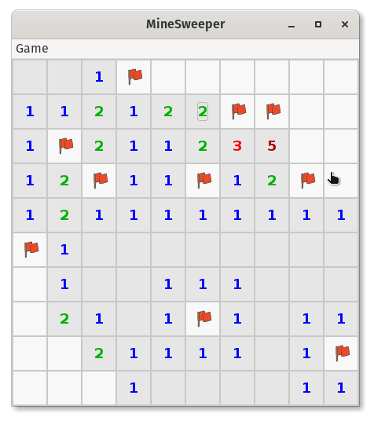
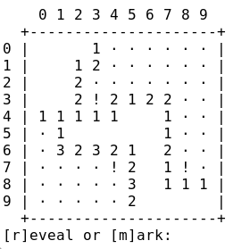

# JMines

**A simple Minesweeper clone that demonstrates a handful of programming concepts**

## Really? Minesweeper?
Yes. Really. It's for learning/teaching purposes. And it's a fun game.

| GUI | CLI |
| --- | --- |
|  |  |

## What's to be learned here?

The idea is to have a well-documented, readable, Open Source implementation of a fun game nearly everyone knows. It's intended to be used for teaching Java and [OOP](https://en.wikipedia.org/wiki/Object-oriented_programming) in a class at the University of Cologne, but everyone's welcome to use it as a learning resource.

All this is still :construction: **work in progress!** :construction:

1. The game has both a **GUI** (graphical user interface) and a **CLI** (command line interface) completely indepentent of each other. The games' core doesn't care which interface it is communicating with. In fact, it doesn't even know. This teaches [**separation of concerns**](https://en.wikipedia.org/wiki/Separation_of_concerns). And a bit of **GUI programming**, obviously.
2. The game implements the [**MVC pattern**](https://en.wikipedia.org/wiki/Model%E2%80%93view%E2%80%93controller) (Model-View-Controller), as it clearly separates _Model_ (the classes `GameState` and `Cell`), _View_ (the user interfaces `JMinesCli` and `JMinesGui`) and _Controller_ (the class `JMines`) logic.
3. The user interfaces (views) and the core game logic class `JMines` (controller) don't need to "know each other". The whole communication is implemented using [**callback interfaces**](https://www.javaworld.com/article/2077462/java-tip-10--implement-callback-routines-in-java.html) (straight from 1996!), effectively achieving [**inversion of control**](https://en.wikipedia.org/wiki/Inversion_of_control).
4. In all of the above, there's a lot of [**object oriented programming**](https://en.wikipedia.org/wiki/Object-oriented_programming).
5. Playing the game itself will teach you logical thinking.

## Third party attribution

The game is currently using a handful of icons form [icons8](https://icons8.com), so thanks for those icons! :open_hands: